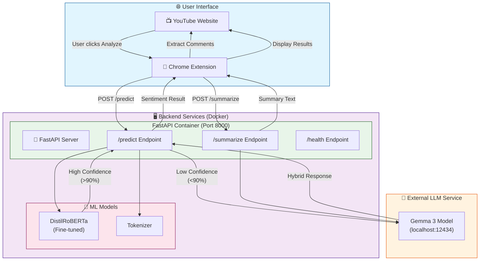
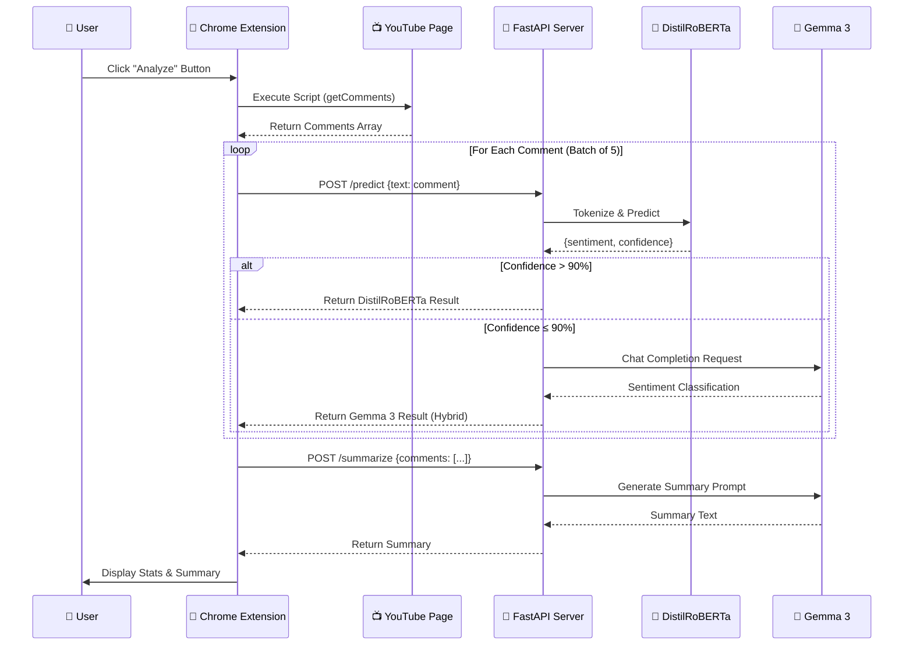
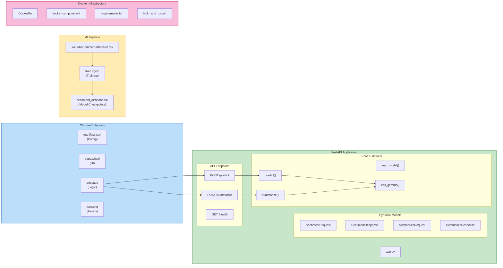
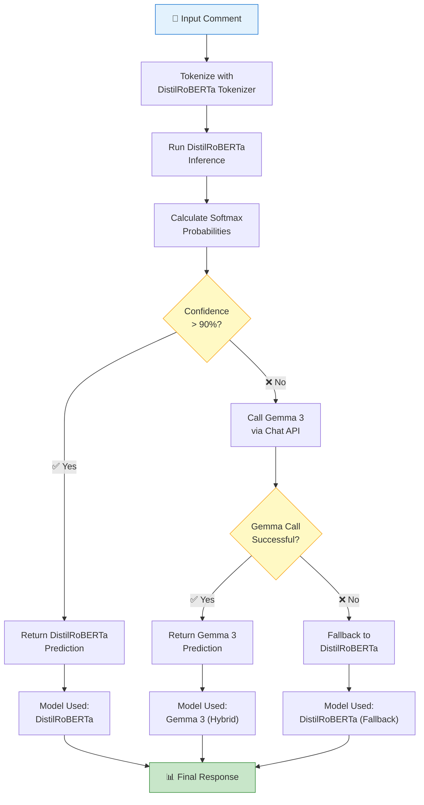
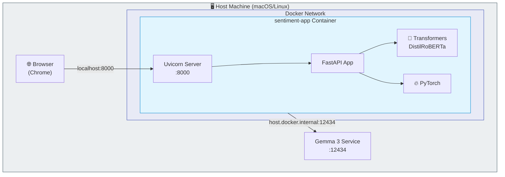
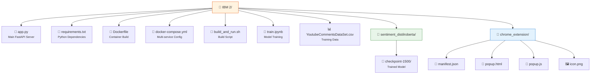
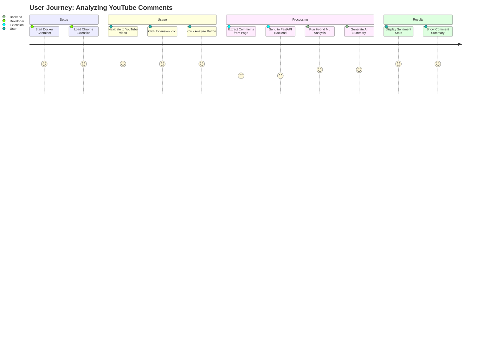

# YouTube Sentiment Analyzer - Project Documentation

## 📋 Project Overview

This project is a **YouTube Comment Sentiment Analyzer** that uses a hybrid AI approach combining a fine-tuned **DistilRoBERTa** model with **Google's Gemma 3** LLM to accurately classify the sentiment of YouTube comments. The system is accessible via a Chrome Extension that integrates directly with YouTube.

---

## 🏗️ System Architecture Diagram



---

## 🔄 Data Flow Diagram



---

## 🧩 Component Architecture



---

## 🔀 Hybrid Sentiment Analysis Logic



---

## 🏛️ Deployment Architecture



---

## 📁 Project Structure



---

## 🛠️ Technology Stack

| Layer | Technology | Purpose |
|-------|------------|---------|
| **Frontend** | Chrome Extension (Manifest V3) | User interface for YouTube integration |
| **API Framework** | FastAPI + Uvicorn | High-performance async REST API |
| **ML Framework** | PyTorch + HuggingFace Transformers | Model loading and inference |
| **Primary Model** | DistilRoBERTa (Fine-tuned) | Fast sentiment classification |
| **Backup LLM** | Google Gemma 3 | Handles low-confidence predictions |
| **Containerization** | Docker + Docker Compose | Consistent deployment environment |
| **Language** | Python 3.10, JavaScript | Backend and extension logic |

---

## 📡 API Endpoints

### POST `/predict`
Analyzes sentiment of a single comment.

```json
// Request
{
    "text": "This video is amazing!"
}

// Response
{
    "sentiment": "positive",
    "confidence": 0.95,
    "model_used": "DistilRoBERTa"
}
```

### POST `/summarize`
Generates a summary of multiple comments.

```json
// Request
{
    "comments": ["Great video!", "Very helpful", "Loved it"]
}

// Response
{
    "summary": "Viewers express positive sentiment, praising the video quality and helpfulness."
}
```

### GET `/health`
Health check endpoint.

```json
{
    "status": "healthy"
}
```

---

## 🚀 Getting Started

### Prerequisites
- Docker & Docker Compose
- Gemma 3 running on `localhost:12434`
- Google Chrome browser

### Quick Start

```bash
# Build and run the sentiment analysis service
docker-compose up --build

# Load Chrome Extension
# 1. Open chrome://extensions
# 2. Enable Developer Mode
# 3. Click "Load unpacked"
# 4. Select the chrome_extension folder
```

---

## 📊 Workflow Summary



---

## 📝 Version History

| Version | Date | Changes |
|---------|------|---------|
| 1.0 | Dec 2024 | Initial release with hybrid DistilRoBERTa + Gemma 3 |

---

*Generated on: December 11, 2024*
